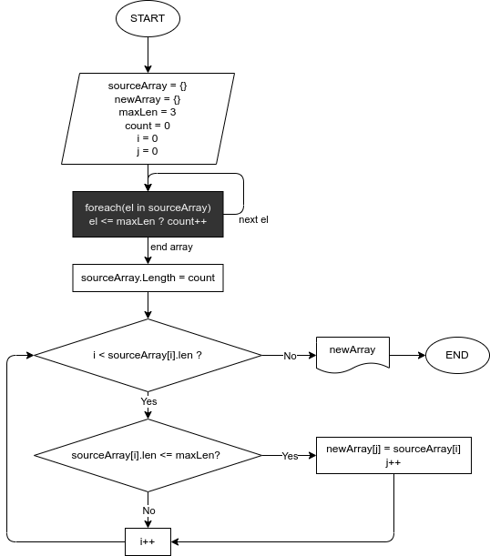

# GB Education. Итоговый проект

## GetFilteredArray

Программа принимает **массив строк** и фильтрует его, на выходе получаем **новый массив с элементами исходного**, длина которых **не превышает заданного\* количества символов**.

Исходный массив формируется путем ввода с клавиатуры, либо используется предварительно заданный.

При запуске, можно выбрать одно из действий:
- Использовать **предварительно заданный массив**. Для этого необходимо сразу нажать Enter, без ввода каких либо символов
- Ввести элементы массива **вручную**. Для ввода строки необходимо ввести строку и нажать Enter. Таким образом можно ввести заданное\* количество строк, либо завершить ввод повторным нажатием Enter

Заданы следующие значения:
- кол-во символов - 3
- макс. кол-во строк для ввода - 30

